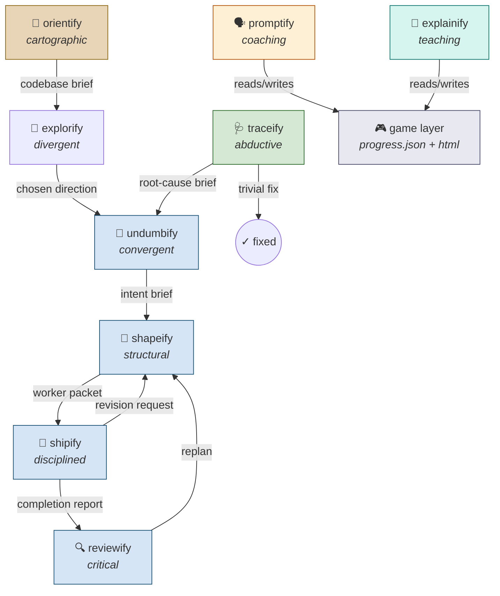

# skillify

Nine interlocking skills for AI-assisted work. Harness-agnostic — works with Qwen Code,
Claude Code, Cursor, OpenCode, Codex, Windsurf, or any agent that reads markdown.

## Install

### Option 1: `npx skills` (recommended, uses symlinks by default)

```bash
# Global install (all detected agents)
npx skills add trykA123/skillify -g

# Target specific agents
npx skills add trykA123/skillify -g -a claude-code -a cursor

# Copy instead of symlink
npx skills add trykA123/skillify -g --copy
```

### Option 2: Manual symlinks via install script

```bash
git clone git@github.com:trykA123/skillify.git ~/path/to/skillify
cd ~/path/to/skillify

# Auto-detect harnesses, symlink globally
./install.sh

# Target specific harnesses
./install.sh --harness qwen,claude,cursor

# Project-local instead of global
./install.sh --project

# Copy instead of symlink (for systems without symlink support)
./install.sh --copy

# Remove
./install.sh --uninstall
```

### Option 3: Reference directly in rules/system prompt

Any harness that accepts a rules file or system prompt can reference the skills directly:

```markdown
<!-- In CLAUDE.md, .cursorrules, AGENTS.md, QWEN.md, etc. -->
When planning implementation, follow: /path/to/skillify/shapeify/SKILL.md
When debugging, follow: /path/to/skillify/traceify/SKILL.md
```

No install needed — the SKILL.md files ARE the prompts.

## The Skills

| Skill | Cognitive mode | Trigger |
|-------|---------------|---------|
| `orientify` | Cartographic — map an unknown codebase before acting | "I just landed in this repo" |
| `explorify` | Divergent — generate radically different options | "I don't know what I want yet" |
| `undumbify` | Convergent — extract intent from ambiguity | "I have a direction but it's vague" |
| `shapeify` | Structural — decompose into executable slices | "Plan this" |
| `shipify` | Disciplined — execute with adaptive validation | "Build this" |
| `reviewify` | Critical — judge against intent, not taste | "Review this" |
| `traceify` | Abductive — infer cause from symptoms | "Something broke" |
| `promptify` | Coaching — teach prompt craft from your real conversations | "Debrief that" |
| `explainify` | Teaching — explain code and its wiring at your level | "What does this do?" |

## How They Connect



**Legend:**
- 🟡 Standalone entry points (orientify, explorify, traceify)
- 🔵 Build pipeline (undumbify → shapeify → shipify → reviewify)
- 🟠/🟢 Teaching cluster (promptify, explainify) sharing the 🎮 game layer
- Feedback loops: shipify can revise the plan cheaply; reviewify can trigger replan

## Topology Awareness

Every skill detects its execution context and adjusts ceremony:

| Topology | Behavior |
|----------|----------|
| **Single-agent** | Handoff artifacts are internal notes. Ceremony collapses. |
| **Subagent** | Full handoff documents. The packet is the only rope. |
| **Hybrid** | Plan in main thread (absorbs nuance), execute in subagent (follows packet). |

## Shared ID System

IDs flow through the pipeline without renaming:

| Prefix | Meaning |
|--------|---------|
| `R*` | Requirements (testable behaviors) |
| `I*` | Invariants (must remain true) |
| `A*` | Acceptance checks (prove R* and I*) |
| `P*` | Plan steps (ordered actions) |
| `S*` | Slices (independently shippable groups) |
| `F*` | Findings (review issues) |

## Design Principles

1. **Constraints over solutions** — extract WHY, not HOW
2. **Anti-examples are high-signal** — "NOT like X" eliminates more than "like Y" generates
3. **Priority ordering resolves conflicts silently** — no asking when things clash
4. **Feeling of done > checklist** — the gestalt guides micro-decisions
5. **Adaptive granularity** — risk determines validation frequency
6. **Living documents** — plans amend in place, no full regeneration
7. **Solo mode is first-class** — one human + one agent is the default

## Repo Structure

```
skillify/
├── README.md
├── install.sh
├── orientify/SKILL.md
├── explorify/SKILL.md
├── undumbify/SKILL.md
├── shapeify/SKILL.md
├── shipify/SKILL.md
├── reviewify/SKILL.md
├── traceify/SKILL.md
├── promptify/
│   ├── SKILL.md
│   ├── game-layer.md
│   ├── html-template.md
│   └── seeds/
└── explainify/
    ├── SKILL.md
    ├── html-template.md
    └── seeds/
```

## Supported Harnesses

The `install.sh` script supports symlinks for:
Qwen Code, Claude Code, Cursor, OpenCode, Codex, Windsurf, GitHub Copilot.

The `npx skills` CLI supports even more — check `npx skills add --help`.

For any other harness: reference the SKILL.md files directly in your rules/system prompt.
They're just markdown with instructions. No magic format required.

## License

MIT
